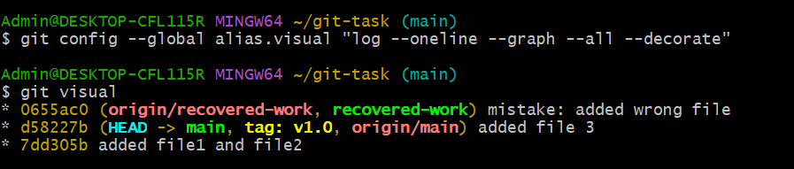

# Homework #1: Git Workflow and History Management

## Overview
This repository contains the completed tasks for the Git Workflow and History Management assignment. It demonstrates initializing a repository, modifying commit history, recovering lost commits, creating aliases, and tagging.

## Tasks Completed
* **Initialized** a Git repository and added 3 files (`file1.txt`, `file2.txt`, `file3.txt`) with unclear commit messages.
* **Cleaned up history** using interactive rebase (`git rebase -i`) to write meaningful commit messages.
* **Simulated a mistake** by adding a bad commit and removing it using `git reset --hard`.
* **Recovered the lost commit** by finding its hash in the `git reflog` and checking it out into a new branch (`recovered-work`).
* **Created a custom Git alias** (`git visual`) to display a clean, graphical history.
* **Tagged** the cleaned-up main branch as version 1.0 (`v1.0`).

## Custom Alias Used
The following alias was configured to generate the visual history below:
`git config --global alias.visual "log --oneline --graph --all --decorate"`

---

## 1. Visual Commit History (`git visual`)
Below is the output of the custom `git visual` command, showing the relationship between the master branch, the recovered branch, and the v1.0 tag:

## Mentor: Berat Ujkani
